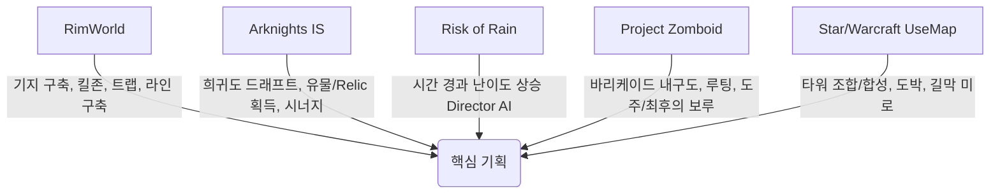

# 🎮 타이쿤 + 로그라이트 + 디펜스 결합 게임 기획안 (3일 개발 스코프)

> **프로젝트 목표**: 림월드의 기지 관리/생존, 명일방주/RoR의 로그라이트 시너지, 스타/워크 유즈맵과 좀보이드의 디펜스 메커니즘을 융합하여 **3일(72시간)** 내에 프로토타입으로 완성 가능한 핵심 재미 검증용 미니 프로젝트 기획.

---

## 1. 장르 결합 시너지 분석 (Genre Fusion Matrix)

| 장르 | 핵심 요소 | 융합 시 역할 | 3일 개발 축소 전략 |
| :--- | :--- | :--- | :--- |
| **타이쿤 (Colony Sim)** | 자원 관리, 기지 확장, 시설 건설, 자동화 | **"전투 중간의 정비 및 성장의 기반"**<br>웨이브 사이에 방어선/생산시설을 확장하고 리소스를 축적 | 자원 종류 2~3종으로 최소화 (예: 전력, 부품/고철)<br>주민 AI 심화 제거 $\rightarrow$ 모듈형 타일/건물 중심으로 단순화 |
| **로그라이트 (Roguelite)** | 무작위 선택, 카드 드래프트, 유물 시너지, 런(Run) 단위 리셋 | **"매판 달라지는 빌드 파워와 쾌감"**<br>웨이브 클리어/시간 경과 시 유물, 타워 모듈, 특성 카드를 선택하여 극단적 시너지 창출 | 퍼마데스(영구 사망) 및 런 종료 시 메타 포인트 기반 기본 능력치 업그레이드만 최소 구현 |
| **디펜스 (Defense)** | 적 웨이브, 킬존(Killzone) 미로 구축, 사거리/타겟팅 메커니즘 | **"플레이의 최종 검증과 긴장감 피크"**<br>구축한 기지와 로그라이트 유물 시너지로 몰려드는 적을 저지 | 길찾기(A* Algorithm)를 단원화하거나 그리드 기반 미로 길막(Mazeing)으로 직관화 |

---

## 2. 레퍼런스 게임 요소 벤치마킹 (Reference Extraction)



1. **림월드 (RimWorld)**
   - **아이디어**: 벽과 바리케이드, 함정을 배치하여 적의 동선을 유도하는 **'킬존(Killzone)'** 메커니즘.
   - **적용**: 플레이어가 그리드에 벽을 설치해 적을 유도하고, 자동으로 딜을 넣는 타워/유닛을 배치.
2. **명일방주 통합전략 (Arknights Integrated Strategies)**
   - **아이디어**: 각 층/웨이브마다 보상으로 유물(Relic)을 획득해 특정 카테고리(예: 범위 공격력 +50%, 전력 생산량 2배)를 극대화하는 시너지.
   - **적용**: 3가지 카드 중 1가지를 선택하는 **로그라이트 드래프트 시스템**.
3. **리스크 오브 레인 (Risk of Rain)**
   - **아이디어**: 시간이 지날수록 난이도 게이지가 실시간으로 상승하는 **'Difficulty Director'** 시스템.
   - **적용**: 파밍 시간을 너무 오래 끌면 적 웨이브가 기하급수적으로 강력해지는 타임 어택 요소.
4. **프로젝트 좀보이드 (Project Zomboid)**
   - **아이디어**: 문/바리케이드가 적 공격에 파손되고, 이를 즉석에서 수리하거나 강화하는 긴박한 좀비 방어감.
   - **적용**: 웨이브 중 수리(Maintenance) 메커니즘 및 멸망 직전 방어선 후퇴(Fallback) 메커니즘.
5. **스타크래프트 / 워크래프트 유즈맵 (랜덤 디펜스 & 미로 디펜스)**
   - **아이디어**: 동일 등급 타워 3개를 합성해 상위 타워 획득 (Random Merge), 자원을 도박/환전하여 리스크 관리.
   - **적용**: 필요 없는 방어 시설을 즉시 환급/합성하거나 자원 환전(고철 ↔ 전력) 기능.

---

## 3. 3일 개발 맞춤 추천 기획안 3선

### 💡 [기획 A - 메인 추천] 《라스트 셸터: 72시간 (Last Shelter: 72 Hours)》
> **한 줄 요약**: "림월드 킬존 구축 + 리스크 오브 레인 타임 게이지 + 명일방주 유물 드래프트가 융합된 탑다운 방벙커 디펜스"

* **핵심 루프**:
  1. **낮 Phase (자원 확장 & 건설)**: generator에서 '전력'을 생산하고, 맵의 자원 노드에서 '고철'을 회수하여 킬존(벽, 타워, 함정)을 건설.
  2. **밤 Phase (웨이브 디펜스)**: 4방향 혹은 특정 웨이브 입구에서 몬스터 대량 습격. 미로화된 방어선으로 방어.
  3. **웨이브 종료 (로그라이트 드래프트)**: 3개의 무작위 카드(유물, 타워 개조 모듈, 자원 펌프 등) 중 1개 선택.
  4. **난이도 스케일링**: 전체 플레이 타임(분)에 따라 적의 HP/수량이 지속 상승하여 빠른 판단과 최적화 강제.

---

### 💡 [기획 B] 《랜덤 크래프트 디펜스 (Random Craft Defense)》
> **한 줄 요약**: "스타 유즈맵 조합 디펜스 + 림월드 자동화 모듈"

* **핵심 메커니즘**:
  - 자원 생산 시설에서 나오는 부품으로 **'랜덤 모듈 타워'**를 가차(Draw)하여 설치.
  - 동일 타워 3개를 합쳐 상위 타워로 진화 (예: [기본 총안구] 3개 $\rightarrow$ [화염방사 타워]).
  - 유물 카드를 통해 특정 계열 타워(예: 전기계열, 화염계열, 관통계열)의 특성을 극한으로 강화.

---

### 💡 [기획 C] 《오버로드 아웃포스트 (Overlord Outpost)》
> **한 줄 요약**: "명일방주 노드 이동 + 림월드 대원 배치 및 킬존 방어"

* **핵심 메커니즘**:
  - 갈림길 노드 맵(슬레이 더 스파이어 방식)을 진행하며 노드마다 [자원 루팅], [기지 개조], [방어전], [상점] 진행.
  - 방어전 노드에서는 직사각형 타일 그리드에서 보유 대원/타워를 배치하여 한정된 웨이브 막기.

---

## 4. [기획 A: 라스트 셸터] 상세 시스템 설계서 (3일 구현용)

```
+-----------------------------------------------------------------+
|                        [ UI Overlay ]                           |
|  Day 02 | Time 14:30 | Danger: HARD | Power: 120 | Scrap: 45     |
+-----------------------------------------------------------------+
|                                                                 |
|     [Spawn] ----> [Wall] ----> [Wall]                           |
|                     |            |                              |
|                     v            v                              |
|                 [Trap Grid] -> [Turret A]                       |
|                                    |                            |
|                                    v                            |
|                            [ Core Engine ] (보호 대상)           |
|                                                                 |
+-----------------------------------------------------------------+
| [Cards Ready: Choose 1 of 3]                                    |
| [1. Overclock Generator]  [2. Tesla Coil Unlocked] [3. Spikes] |
+-----------------------------------------------------------------+
```

### 1) 시스템 핵심 요소 (Core Systems)

1. **자원 시스템 (Two-Resource Economy)**
   - ⚡ **전력 (Power)**: 타워 및 시설을 가동하기 위한 수용량(Capacity) 및 유지비.
   - ⚙️ **고철 (Scrap)**: 건물 건설, 바리케이드 수리, 업그레이드에 쓰이는 기본 재화. 적 처치 및 파밍으로 획득.

2. **건설 & 킬존 시스템 (Grid Building)**
   - **바리케이드 / 벽 (Wall)**: 적의 패스파인딩 경로를 막아 동선을 우회시킴 (내구도 존재, 파괴 가능).
   - **사격 타워 (Turrets)**: 자동 사격 타워. 전력을 소비함.
   - **함정 (Traps)**: 둔화(Slow), 이속 감소, 장판 딜(Spike/Oil).
   - **코어 엔진 (Core Engine)**: 기지 중앙의 보호 목표 (HP 0이 되면 게임 오버).

3. **로그라이트 카드 드래프트 (Card Draft)**
   - 매 웨이브 클리어 시 3장의 카드 발급:
     - **유물 (Relics)**: "모든 전기 타워의 체인 연쇄 +2", "코어 체력 20% 이하 시 전체 적 3초 빙결"
     - **시설 해금 (Unlocks)**: "플라즈마 캐논 건설 가능", "자동 수리 로봇 설치"
     - **경제/생산 (Economy)**: "고철 획득량 +50%", "전력 생산 건물 Efficiency +30%"

---

## 5. 3일(72시간) 개발 타임라인 & MVP 스코프

### 📅 Day 1: 전투 & 그리드 방어 기본 루프 (Foundations)
* **목표**: 맵 그리드, 벽 설치, 적 A* 길찾기 및 타워 기본 공격 구현
* [ ] 2D 그리드 시스템 (Tilemap) 및 건설/파괴 로직
* [ ] 적 스폰 및 타겟(코어)까지의 길찾기 (A* / NavMesh2D)
* [ ] 기본 타워(총알 발사) 및 기본 바리케이드(체력/파괴)
* [ ] 코어 파괴 시 Game Over 및 단순 리스타트

### 📅 Day 2: 타이쿤 생산 + 로그라이트 드래프트 (Economy & Roguelite)
* **목표**: 자원 수급, 웨이브 상태 전환, 카드 선택 시너지 구현
* [ ] 전력/고철 자원 루프 (생산 건물 1종, 고철 획득)
* [ ] 웨이브 관리자 (Prep Phase $\leftrightarrow$ Defense Phase)
* [ ] 카드 드래프트 UI (3개 중 1개 선택 모달)
* [ ] 카드 효과 데이터 구조 구축 (Stat Buff, New Building Unlock)
* [ ] 유물 시너지 5~8종 구현

### 📅 Day 3: 밸런싱, 수치 조절 및 쥬스(Juice/Visual Polish)
* **목표**: 게임의 손맛과 피드백 강화, 사운드/이펙트 추가
* [ ] 시간에 따른 난이도 상승 (Director AI: 적 HP/스피드/스폰 속도 증가)
* [ ] 타격 피드백 (화면 흔들림 Screen Shake, 피격 플래시, 몬스터 사망 파티클)
* [ ] 사운드 효과 (타워 발사음, 건설음, 경보음, BGM)
* [ ] UI Polish (자원 표시, 웨이브 카운트다운, 난이도 게이지)

---

## 6. 3일 개발을 위한 비용 절감 핵심 팁 (Scope-Cutting Rules)

> ⚠️ **3일 개발에서 가장 위험한 것은 '자율 이동하는 주민 AI'와 '복잡한 인벤토리'입니다.**

1. **주민 AI 삭제 $\rightarrow$ 타일/건물 자동화로 대체**
   - 림월드의 일꾼(Colonist) 이동/작업 AI는 버그 유발 1순위입니다. 모든 관리는 **플레이어가 직접 클릭하여 즉시 건설/수리**하는 방식으로 대체합니다.
2. **그래픽은 에셋 스토어 / 기하학 도형 활용**
   - 사각형, 원형, 파티클 기반의 미니멀리스트 픽셀 아트나 프로토타입 2D 에셋 패크 사용.
3. **패스파인딩 최적화 (Grid Wall Maze)**
   - 적은 코어로 이동하려 하며, 벽으로 완전히 막히면 벽을 공격하도록 처리 (RimWorld 킬존 방식).
4. **시너지 효과는 숫자로 통제**
   - 복잡한 신규 애니메이션이 필요한 시너지 대신 **공격속도 200%, 유도탄 전환, 사거리 증가, 장판 생성** 등 프로그래밍 수치 중심 시너지 설계.

---

## 7. 결론 및 피드백 액션 플랜

본 기획안은 **"림월드의 킬존 미로 방어 + 로그라이트의 시너지 폭발 + 타이쿤의 기지 성장"**을 3일 안에 실현 가능하도록 인공지능/주민 요소를 제거하고 **그리드 타워/자원 2종** 구조로 조정한 프로토타입 모델입니다.

- **권장 개발 환경**: Unity 2D 또는 Godot Engine (그리드 타일맵 및 2D Physics 지원)
- **최우선 검증 과제**: *"벽으로 적 이동 경로를 유도하고 타워와 유물 카드로 적을 쓸어버리는 재미가 1~2회 런(Run)에서 확실히 느껴지는가?"*
