# ⚡ 웹 2D/2.5D 3인 멀티플레이어 게임 기술 아키텍처 & 내러티브 설계서

> **프로젝트 목표**: 3일 개발 제약 하에서 **Phaser 3 / Three.js + Node.js (Colyseus) + PostgreSQL**을 활용하여 3인 협동(Co-op) "약해빠진 용사 파티의 마왕 토벌 로그라이트 디펜스" 구축.

---

## 1. 기술 스택 추천 및 비교 (Tech Stack Selection)

### 🎨 클라이언트 렌더링 엔진 (Client Engine)

| 엔진 | 2D 탑뷰 구현성 | 3일 개발 추천도 | 특징 및 장단점 |
| :--- | :--- | :--- | :--- |
| **Phaser 3** | ⭐⭐⭐⭐⭐ (최상) | **🟢 1순위 추천** | • 2D 전용 완성형 프레임워크 (타일맵, 아케이드 물리, 카메라, 스프라이트 애니메이션, 사운드 내장)<br>• 2D 탑뷰/디펜스 구현 속도가 가장 빠름 |
| **Three.js (Orthographic)** | ⭐⭐⭐⭐ (상) | **🟡 2순위 추천 (2.5D)** | • 정사영(Orthographic) 카메라 사용 시 **림월드/돈스타브 스타일 2.5D** 구현 가능<br>• 동적 3D 조명/그림자 효과 우수하나, 2D 타일맵/물리엔진을 별도 구축해야 함 |
| **Pixi.js v8** | ⭐⭐⭐ (중) | **🔴 미추천** | • 초고속 렌더러지만 게임 엔진이 아님 (물리/카메라/타일맵 직접 코딩 필요) |

---

### 🌐 서버 & 멀티플레이어 (Server & Networking)

1. **Colyseus (Node.js + TypeScript) [강력 추천]**
   - 웹소켓(WebSocket) 기반의 **룸(Room) 및 상태 동기화(State Synchronization)** 전용 프레임워크.
   - `PlayerPosition`, `BaseHP`, `DayNightCycle` 등 서버 데이터 스키마만 정의하면 클라이언트와 자동 시그널 동기화.
   - Socket.io 대비 보일러플레이트 코드를 **80% 절감**하여 3일 프로젝트에 필수적.
2. **PostgreSQL + Prisma/Supabase**
   - 인게임 런(Run) 중의 동적 데이터(유닛 위치, 자원 등)는 **Node.js 서버 메모리**에서 빠른 연산.
   - PostgreSQL은 **런 완료 후 메타 프로필, 유저 랭킹, 캐릭터 해금 상태 저장**용으로 최소화하여 연결.

---

## 2. 미정 기획 요소 심층 탐색 & 해결 방안

```
+-----------------------------------------------------------------------------------+
|                           [ 3인 용사 파티의 하루 루프 ]                             |
+-----------------------------------------------------------------------------------+
| [낮 (Day - 90초)]                                                                  |
| • 맵 탐색, 몬스터 사냥(EXP), 자원(목재/고철) 채집, 거점 확보                         |
| • 3인이 분산해서 루팅 후 베이스캠프로 복귀                                          |
+-----------------------------------------------------------------------------------+
                                      │
                                      ▼
+-----------------------------------------------------------------------------------+
| [밤 (Night - 60초)]                                                                |
| • 마왕군 디펜스: 베이스캠프 공성전 방어                                            |
| • 1명: 자원 납품 및 기지/타워 즉시 수리/업그레이드 (타이쿤)                          |
| • 2명: 외곽 몬스터 탄막/스킬 방어 (로그라이트 콤보)                                 |
+-----------------------------------------------------------------------------------+
                                      │
                                      ▼ (Day 5 도달 시)
+-----------------------------------------------------------------------------------+
| [최종 레이드 (Final Boss)]                                                         |
| • 격리된 '마왕의 둥지(Arena)'로 포탈 이동                                         |
| • 대형 Hitbox 마왕 vs 3인 용사 탄막 피하기 & 딜찍누 레이드                           |
+-----------------------------------------------------------------------------------+
```

### ❓ 미정 1: 보스전 장소 (개방 맵 vs 격리된 아레나 룸)

* **선택: [격리된 아레나 룸 (Instanced Boss Arena)] 추천!**
  - **이유 1 (개발 효율)**: 개방 맵에서 보스 탄막을 사방으로 쏠 경우, 타일맵 지형 충돌/길막 버그가 다수 발생함. 격리된 원형/직사각형 아레나 맵은 탄막 판정과 카메라 연출 집중 가능.
  - **이유 2 (레이드 긴장감)**: Day 5 밤이 끝나면 베이스캠프 중앙에 **'마왕의 차원문'**이 열리고, 3인 파티가 동시 레디(Ready)를 눌러 레이드 룸으로 이동하는 연출이 몰입감을 최고조로 끌어올림.

---

### ❓ 미정 2: 마왕의 행동 양식 (베이스캠프 침공 vs 마왕 둥지 토벌)

* **선택: [1~4일차 마왕군 공성 디펜스 + 5일차 마왕 둥지 역침공 레이드] 추천!**
  - **1~4일차 밤**: 마왕은 베이스캠프에 자신의 부하(중보스/웨이브)를 보내 베이스캠프를 파괴하려 함.
  - **5일차 (D-Day)**: 약해빠졌던 용사 파티가 4일간 성장하여 마왕을 응징하러 **마왕의 둥지로 역침공**!
  - **효과**: "방어만 하던 처지에서 며칠 만에 마왕을 때려잡으러 가는 용사 파티"의 서사적 역전 카타르시스 극대화.

---

## 3. 3인 협동(Co-op) 역할 분담 & 3일 개발 맞춤 보스 패턴

### 👥 3인 파티 역할 분담 (Role Synergy)
1. **탱커/건설가 (Tank / Engineer)**:
   - 채집 효율 증가, 베이스캠프 건설/수리 수치 증가, 적의 어그로 핑퐁.
2. **딜러/사냥꾼 (DPS / Hunter)**:
   - 필드 몬스터 빠른 사냥, 마왕 레이드 단일 딜링 피크.
3. **서포터/연금술사 (Support / Alchemist)**:
   - 아군 이동속도/버프, 몬스터 디버프/둔화 장판, 카드 드래프트 리롤 혜택.

---

### 👾 마왕 보스 패턴 설계 (Bullet Hell Raid)

3일 구현을 위해 **대형 픽셀/스프라이트 + 탄막 궤적 연산**으로 구성:

```
                  [ 마왕 (대형 Hitbox) ]
                             │
     ┌───────────────────────┼───────────────────────┐
     ▼                       ▼                       ▼
 [패턴 1: 나선형 탄막]     [패턴 2: 타겟 장판]      [패턴 3: 광폭화 충격파]
 360도 전방향 탄막         플레이어 위치 붉은 원    코어 근접 공격 넉백
 (이동으로 피하기)         (1.5초 후 폭발)          (탱커가 전면 방어)
```

---

## 4. 3일 개발 72시간 타임라인 (Multiplayer Dev Roadmap)

```mermaid
gantt
    title 3일 멀티플레이 미니 프로젝트 개발 일정
    dateFormat X
    axisFormat Day %O

    section 클라이언트 (Phaser 3)
    2D 그리드 & 용사 조작          :active, d1, 0, 1d
    자원 채집 & 베이스 캠프 건설    :d2, after d1, 1d
    탄막 보스전 & UI Polish        :d3, after d2, 1d

    section 서버 (Colyseus Node.js)
    3인 위치 & 룸 동기화            :active, s1, 0, 1d
    낮/밤 루프 & 방어 웨이브 로직    :s2, after s1, 1d
    보스 탄막 패턴 & DB 랭킹       :s3, after s2, 1d
```



### 📅 Day 1: 3인 네트워크 동기화 & 기본 필드
* [ ] Node.js + Colyseus 서버 구성 및 3인 룸 생성 로직
* [ ] Phaser 3 (또는 Three.js) 2D 탑뷰 맵 및 3인 캐릭터 이동 동기화
* [ ] 필드 몬스터 및 기본 자원(목재, 철) 스폰

### 📅 Day 2: 낮/밤 루프 + 타이쿤 디펜스
* [ ] 서버 낮/밤 타이머 동기화 (Day 90초 / Night 60초)
* [ ] 낮: 자원 루팅 및 베이스캠프 가져다주기 (기지 레벨업)
* [ ] 밤: 베이스캠프를 향한 적 A* 길찾기 및 타워 사격
* [ ] 웨이브 종료 후 3인 개별 카드 드래프트 선택

### 📅 Day 3: 마왕 레이드 & 폴리싱
* [ ] Day 5 마왕 아레나 룸 이동 로직
* [ ] 마왕 대형 피격판정 및 탄막 패턴 3종 구현
* [ ] PostgreSQL에 런 결과(클리어 타임, 랭킹) 저장
* [ ] 이펙트, 사운드, 승리/패배 씬 Polish
